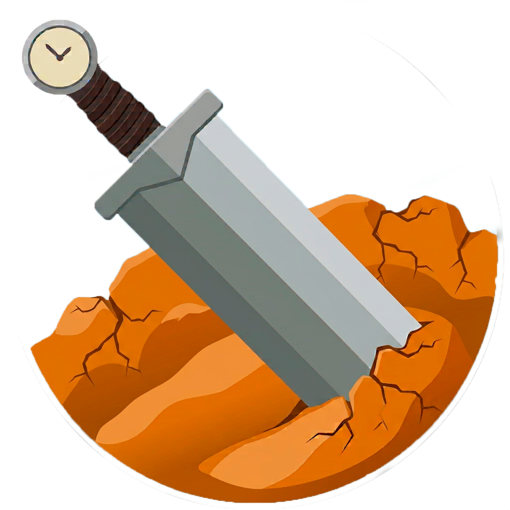
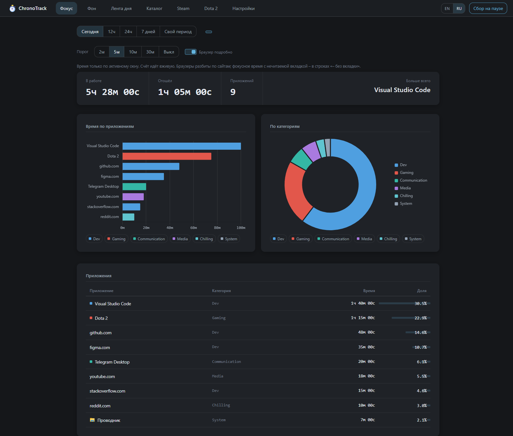
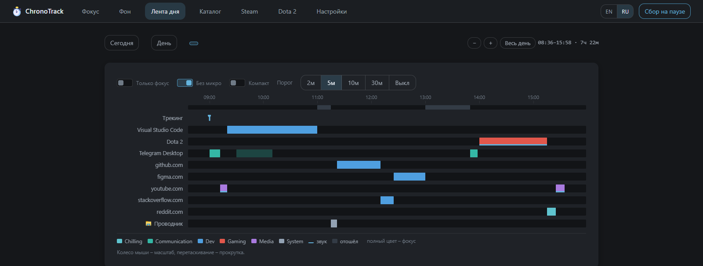
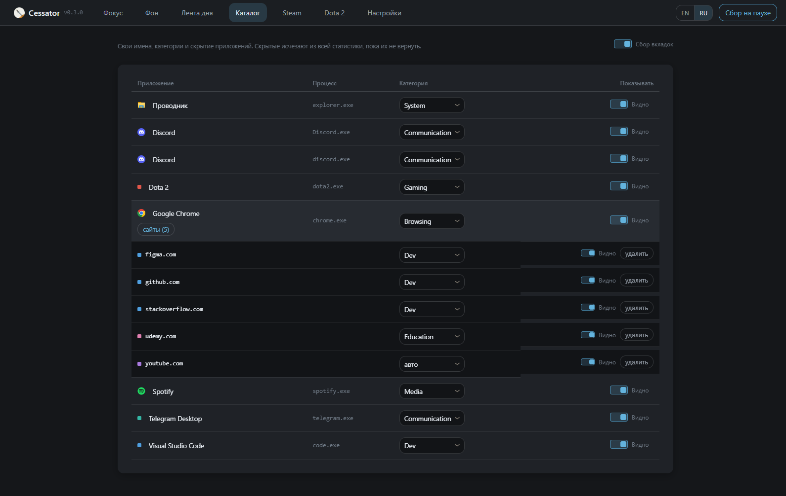
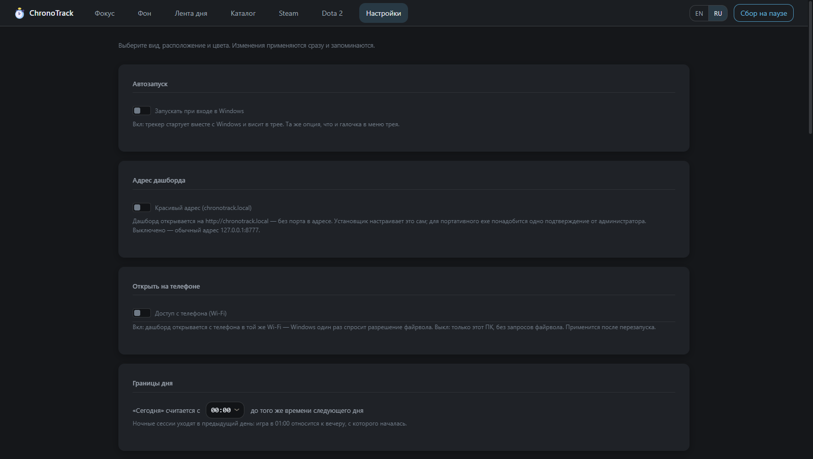
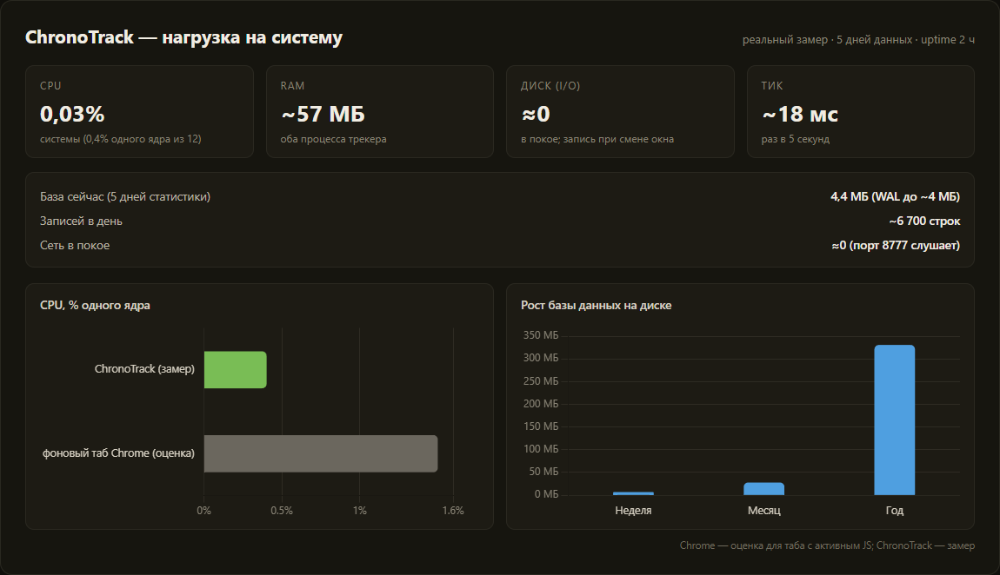

# Cessator

**Честная статистика времени на вашем ПК.**
*Cessator (лат.) — «бездельник»: тот, кто сложил оружие и отдыхает.*

Сколько времени какие приложения открыты, находятся в фокусе и играют звук.
Плюс живой мониторинг друзей в Steam и послематчевая аналитика Dota 2.
Можно чекать активность даже по вкладкам браузера, а не только по открыт/закрыт ли браузер

PS Код не заливаю не потому что жадный, а просто не хочу случайно личную инфу залить)

---

Обзор дня: фокус по приложениям, кольцо категорий и разбивка браузера по сайтам - без единого расширения.

## Возможности

### Трекер времени

- **Фокус и фон** - считайте время только по активному окну или по всем
  открытым сразу. Периоды: сегодня, 12ч, 24ч, 7 дней или свой диапазон
  с календарём и подсветкой дней активности.
- **Вкладки браузера - без расширения.** Адресная строка фокусируемого
  окна читается через Windows UI Automation: браузер разворачивается по
  сайтам (youtube.com, github.com, …). Работает в Chrome, Edge, Brave,
  Vivaldi и Firefox.
- **Лента дня** - вся суточная шкала на одном экране: полосы приложений,
  слои фокуса и звука, периоды «отошёл», отметки запуска трекера.
- **Игра идёт прямо сейчас** - локальный детект запущенной игры с живым
  таймером: карточка появляется через ~5 секунд после запуска.
- **«Отошёл / вернулся»** по простою ввода; звук в фокусе отменяет away.

Лента дня: зум колесом мыши, перетаскивание - прокрутка, короткие фокусы скрываются порогом.

### Каталог

- **Свои имена** приложениям - «code.exe» превращается в «Visual Studio Code».
- **Категории и скрытие** для приложений и отдельных сайтов: правило,
  переопределение из дашборда или скрыть совсем - данные остаются.
- У браузеров каталог раскрывается по вкладкам: категория и удаление
  данных для каждого сайта отдельно.

Каталог: Google Chrome раскрыт по сайтам - у каждого своя категория и видимость.

### Steam

- **Сейчас играет, библиотека, друзья онлайн и в игре** - метрики на
  одном экране.
- **Сессии друзей за день** - по строке на друга, полосы по каждой игре,
  тултипы «игра · время · длительность», выбор дня календарём.
- **Свои имена друзьям** (✎) и **скрытие** (✕): переименованный друг
  показывается везде вместо ника, скрытый - не отслеживается и не мешает.
- Выключатель «отслеживать друзей» - полностью останавливает опрос.

### Dota 2

- **Список матчей** как сводка периода: W/L, полоса винрейта, средний
  KDA, самый частый герой, теплокарта 12 недель.
- **Обзор матча** - карточка «я», скорборд двух команд с позициями,
  KDA, уроном и нетворсом, предметы, драфт, бенчмарки против ранга.
- **Таймлайн матча** - объекты, бои и покупки на одной шкале с зумом
  выделением и синхронным плеихедом.
- **Источники**: OpenDota (без ключа) и STRATZ PRO-слой (бесплатный
  персональный токен) - IMP, вероятность победы по минутам, золото по
  источникам, CS@10/20.

### Настройки

- 4 стиля интерфейса (Classic / Playful / Terminal / Player) × тёмная и
  светлая темы, цвета категорий, вид навигации и вкладок.
- Язык **EN / RU**, граница дня (ночные сессии уходят во вчерашний день).
- **Автозапуск при входе в Windows** - переключатель здесь и галочка
  в меню трея, состояние синхронизировано.
- **Красивый адрес** `cessator.local` без порта в адресе.
- **Доступ с телефона** по Wi-Fi - дашборд открывается с телефона в той
  же сети.
- Баннер обновлений: источник уже вшит (GitHub проекта) - при выходе
  новой версии появится ссылка на скачивание; можно указать свой
  репозиторий или `latest.json`. Текущая версия - в шапке дашборда.
- Полное удаление программы в два клика, с опцией стереть данные.

Настройки: автозапуск, красивый адрес, доступ с телефона и граница дня.

## Приватность

- **Без облака, без аккаунтов, без телеметрии.** Дашборд - это локальный
  сервер на вашем ПК.
- Вся статистика - в локальной SQLite-базе в выбранной вами папке.
- Ключи Steam / STRATZ хранятся только в локальном конфиге и никогда
  не попадают в браузер.
- Доступ по сети выключен по умолчанию и включается явно.

## Установка

1. Скачайте `Cessator.exe` из [Releases](../../releases) — портативный файл,
   без установщика: положите куда удобно и запустите.
2. При первом запуске программа спросит папку для локальной базы
   (по умолчанию — `%LOCALAPPDATA%\Cessator`).
3. Дашборд откроется сам на `http://127.0.0.1:8777`, значок появится в трее.
4. Хотите адрес без порта — включите «Красивый адрес (cessator.local)»
   в Настройках: Windows один раз спросит подтверждение администратора.

Windows может предупредить о неизвестном издателе (exe не подписан) —
«Подробнее → Выполнить в любом случае».

Обновление - скачайте новый `Cessator.exe` и замените старый файл:
данные, ключи и настройки живут отдельно от программы и не затираются.
Прежние версии ChronoTrack подхватывают всё сами - статистика, ключи
и автозапуск переезжают автоматически.

## Как это работает

Каждые ~5 секунд снимается срез видимых окон верхнего уровня (как в
Alt-Tab), флаг звука по процессу и глобальный простой ввода. При смене
состояния окна строка в базе закрывается и открывается новая. Steam-друзья
опрашиваются раз в 90 секунд, Dota-матчи подтягиваются из OpenDota/STRATZ
после окончания партии.

Программа сидит в трее: открыть дашборд, пауза сбора, автозапуск, выход.

## Нагрузка на систему

Трекер спроектирован так, чтобы быть незаметным: один процесс в трее,
опрос окон раз в 5 секунд и крошечные записи в локальную SQLite-базу.
Веб-дашборд работает по запросу - пока вкладка закрыта, он ничего не делает.

Замер на обычном домашнем ПК (12 потоков, живая база за 5 дней):

Замер: метрики процесса, сравнение CPU с фоновым табом Chrome и рост базы на диске.

| Метрика | Значение |
|---|---|
| CPU | **0,03%** системы (0,4% одного ядра) |
| RAM | **~57 МБ** на оба процесса |
| Диск (I/O) | **≈0** в покое - запись только при смене окна |
| Один цикл опроса | **~18 мс** раз в 5 секунд |
| Сеть в покое | ≈0 - порт 8777 просто слушает |

Для сравнения: один фоновый таб Chrome с активным JS занимает ~1,5% ядра -
в несколько раз больше, чем весь Cessator.

Рост базы данных - по живым данным (~6 700 записей в день; строка
открывается только при смене состояния окна, а не на каждом опросе):

| Период | База статистики |
|---|---|
| Неделя | ~6 МБ |
| Месяц | ~27 МБ |
| Год | ~330 МБ |

Кэши Steam / Dota / STRATZ добавляют единицы мегабайт.

---

**Cessator** — время говорит само за себя.

